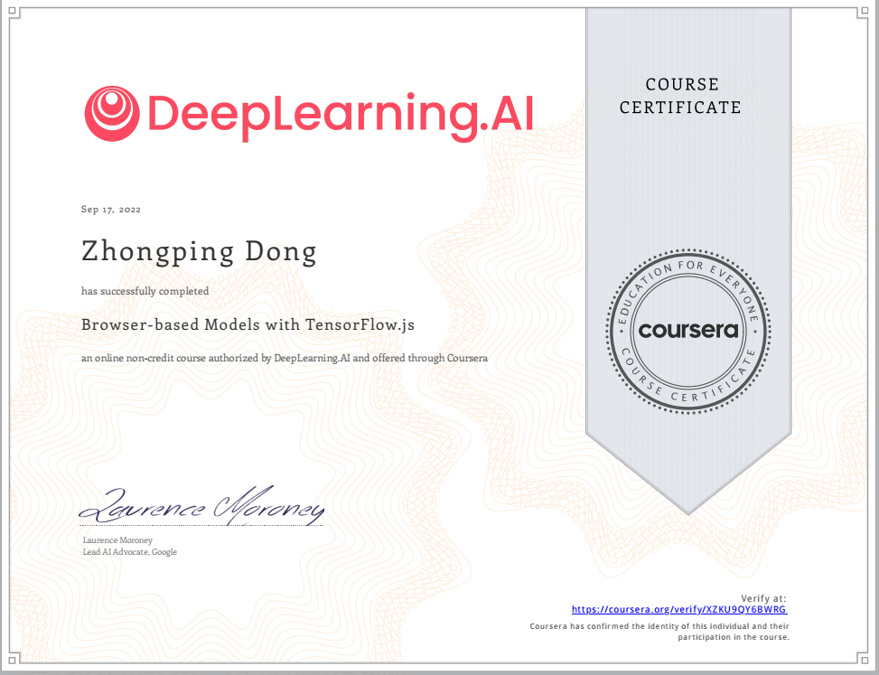

## Browser-based Models with TensorFlow.js

**About this Course**

Bringing a machine learning model into the real world involves a lot more than just modeling. This Specialization will teach you how to navigate various deployment scenarios and use data more effectively to train your model.

In this first course, you’ll train and run machine learning models in any browser using TensorFlow.js. You’ll learn techniques for handling data in the browser, and at the end you’ll build a computer vision project that recognizes and classifies objects from a webcam.

This Specialization builds upon our TensorFlow in Practice Specialization. If you are new to TensorFlow, we recommend that you take the TensorFlow in Practice Specialization first. To develop a deeper, foundational understanding of how neural networks work, we recommend that you take the Deep Learning Specialization.

### Certificate

### Notebook

### Week1
- Specialization Introduction
- Training and Inference using TensorFlow.js in JavaScript
- Training Models with CSV Files
- [Lecture Code](./week1/LectureNotes)
- [Programming Assignment: Week 1 - Breast Cancer Classification](./week1/Exercises)

### week2
- Creating Convolutional Neural Networks in JavaScript
- Using a Sprite Sheet
- MNIST Classifier
- [Lecture Code](./week2/LectureNotes)
- [Programming Assignment: Week 2 - Fashion MNIST Classifier](./week2/Exercises)

### week3
- Toxicity Classifier
- Image Classification Using MobileNet
- Converting Models to JSON Format
- [Lecture Code](./wee3/LectureNotes)
- [Programming Assignment: Week 3 - Converting a Python Model to JavaScript](./week3/Exercises)

### week4

- Retraining the MobileNet Model
- Capturing the Data
- Performing Inference From the Webcam Feed
- [Lecture Code](./week4/LectureNotes)
- [Programming Assignment: Week 4 - Rock Paper Scissors](./week4/Exercises)
